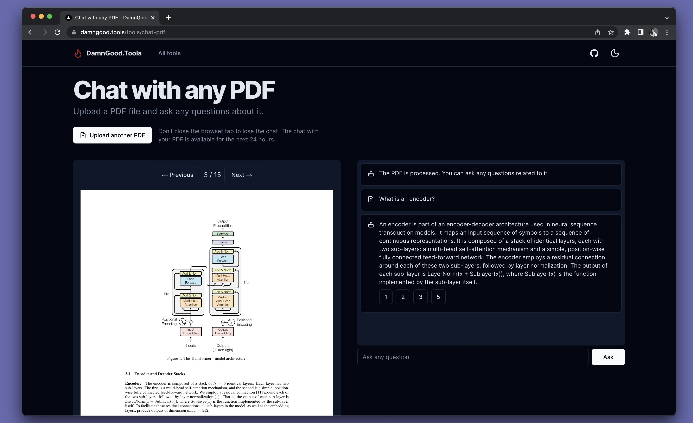

# DamnGood.Tools

A set of damn good tools built for fun, to play with Next.js and to catch up with the latest AI technologies. 

Available tools: 

* [Privacy policy generation](https://damngood.tools/tools/privacy-policy-generator);
* [Font detection](https://damngood.tools/tools/detect-fonts);
* [Chat with any PDF](https://damngood.tools/tools/chat-pdf);
* [Summarize any URL](https://damngood.tools/tools/summarize-any-url);
* [Screenshots](https://damngood.tools/tools/screenshots-for-dimensions);
* [Spellcheck and grammar fixing](https://damngood.tools/tools/grammar-fixer);

And [many more](https://damngood.tools/).

A screenshot of an example tool—["Chat with any PDF"](https://damngood.tools/tools/chat-pdf): 

## Stack 

The goal of this project for me is to have fun and explore my creativity. Expect to see a lot of technologies used in this one little lovely repository: 

* [Next.js](https://nextjs.org/) — the React framework for the web. 
* [TypeScript](https://www.typescriptlang.org/) as the main language of the project.
* [SQLite](https://www.sqlite.org/index.html) as the main database.
* [Litestream](https://litestream.io/) for continuously streaming SQLite changes to AWS S3, Azure Blob Storage, Google Cloud Storage, SFTP, or NFS. 
* [OpenAI APIs](https://platform.openai.com/docs/api-reference) for AI-based tools.
* [ScreenshotOne](https://screenshotone.com/) for rendering website screenshots.
* [GetURLData](https://geturldata.com/) for extracting website fonts and metadata.
* [shadcn/ui](https://ui.shadcn.com/) is a beautifully designed component library.

## License

Licensed under the [AGPL-3.0 license](./LICENSE).

Feel free to copy parts of the code and use them to improve your projects. Attribution or backlinks are much appreciated, especially to the [DamnGood.Tools](https://damngood.tools/).

But please, don't use this code to compete directly with the tools. # damngoodtools
# damngoodtools
# damngoodtools
